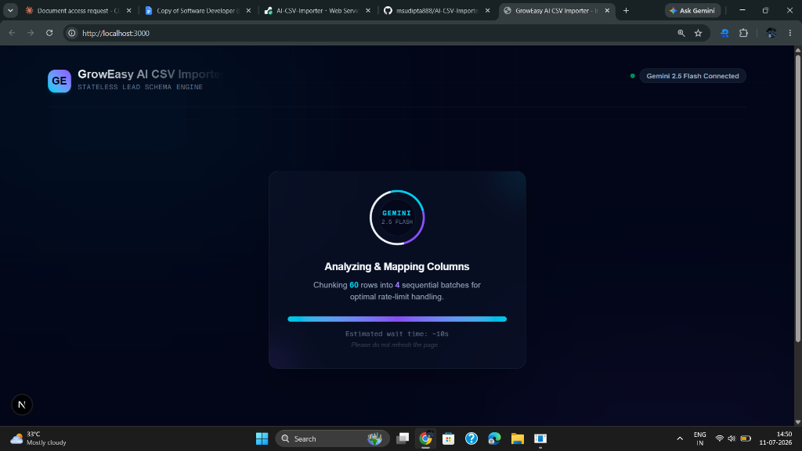

# GrowEasy AI CSV Importer 🚀

[](https://ai-csv-importer-rust.vercel.app/)
[](https://ai-csv-importer-y2d8.onrender.com)
[](https://nextjs.org/)
[](https://expressjs.com/)
[](https://deepmind.google/technologies/gemini/)

An intelligent, production-grade, AI-powered CRM lead mapping engine. This application allows users to upload arbitrary CRM lead CSV files with dynamic/unknown column structures and header names, preview them in real-time, and leverage Google Gemini 2.5 Flash to automatically parse, clean, and structure the records into GrowEasy's fixed target CRM schema.

Designed with robust validation, self-healing LLM retry logic, and strict rate-limit protection to guarantee high reliability under free-tier constraints.

---

## 📷 Application Preview

Below is a preview of the stateless lead schema engine in action, showing the real-time sequential chunking and processing of leads:



---

## 🔗 Live Application Links

- **Production Frontend**: [https://ai-csv-importer-rust.vercel.app/](https://ai-csv-importer-rust.vercel.app/)
- **Production Backend API**: [https://ai-csv-importer-y2d8.onrender.com](https://ai-csv-importer-y2d8.onrender.com)

---

## 🏗️ Technical Architecture & Design Decisions

*   **100% Stateless Design**: No database, Redis cache, or temporary local disk writes. CSV files are parsed directly in the client browser memory, transmitted as raw JSON, processed by the Gemini model inside the HTTP request lifecycle, validated, and returned. This ensures maximum data privacy and low infrastructure overhead.
*   **Gemini Rate-Limit Guarding (Free Tier)**: The backend automatically splits rows into sequential chunks (default batch size of 15) and enforces a 2-second delay between batch requests. This prevents `429 (Too Many Requests)` rate-limiting exceptions under Gemini's free tier limits.
*   **Self-Healing AI Retries**: Incorporates a built-in recovery mechanism. If the AI model returns invalid JSON or fails due to transient network issues, the extractor retries the extraction request once with a delay before marking that batch as skipped, avoiding global upload failures.
*   **CSV Injection & Escape Safety**: The post-processing validator cleans all incoming data and converts raw newlines/carriage returns (`\n` or `\r\n`) in text fields into literal string `\n` characters to ensure downstream CSV outputs remain safe and properly escaped.
*   **Loose-to-Tight Mapping Strategy**: Client-side uploads accept any CSV. The LLM performs semantic analysis to map keys like `Work Email`, `Mail`, or `E-Mail ID` to `email`, and places non-matching details or extra contacts into a catch-all `crm_note` field so no data is lost.

---

## 🎯 GrowEasy CRM Target Schema

All uploaded leads are structured into the following strict **15-field CRM schema**:

| Field Name | Expected Type | Description / Validation Rule |
| :--- | :--- | :--- |
| `created_at` | `String` | Parseable date format. Defaults to execution time if absent. |
| `name` | `String` | Full name of the lead. |
| `email` | `String` | Cleaned email address. Primary email field. |
| `country_code` | `String` | Phone country dial code (e.g. `+91`). |
| `mobile_without_country_code` | `String` | Cleaned mobile digits without country prefix. |
| `company` | `String` | Name of the lead's company. |
| `city` | `String` | City name. |
| `state` | `String` | State / Province name. |
| `country` | `String` | Country name. |
| `lead_owner` | `String` | Email of the assigned lead owner/agent. |
| `crm_status` | `Enum` | Must be exactly: `GOOD_LEAD_FOLLOW_UP`, `DID_NOT_CONNECT`, `BAD_LEAD`, or `SALE_DONE`. Otherwise blanked out. |
| `crm_note` | `String` | Catch-all for extra contact details, secondary emails, and raw unmapped details. |
| `data_source` | `Enum` | Must be exactly: `leads_on_demand`, `meridian_tower`, `eden_park`, `varah_swamy`, or `sarjapur_plots`. Otherwise blanked out. |
| `possession_time` | `String` | Lead's project possession details. |
| `description` | `String` | General notes or descriptions. |

> ⚠️ **Skip Rule**: Leads lacking **both** an `email` and a `mobile_without_country_code` are automatically filtered out and returned under the **Skipped Records** list with the reason: `"No email or mobile number found"`.

---

## 📁 Directory Structure

```text
csv_importer/
├── backend/
│   ├── src/
│   │   ├── prompts/
│   │   │   └── extractionPrompt.js  # Strict mapping prompt for Gemini
│   │   ├── routes/
│   │   │   └── import.js            # Express router for batch handling
│   │   ├── services/
│   │   │   ├── aiExtractor.js       # Google Generative AI integration with retries
│   │   │   ├── csvParser.js         # CSV string/key normalization service
│   │   │   └── validator.js         # CRM schema compliance & sanitization
│   │   ├── tests/
│   │   │   ├── aiExtractor.test.js  # Jest tests for AI connector & retry loops
│   │   │   ├── csvParser.test.js    # Unit tests for trimmer and parser
│   │   │   └── validator.test.js    # Unit tests for CRM skip & whitelist rules
│   │   └── server.js                # Server entry point
│   ├── package.json
│   └── .env.example
├── frontend/
│   ├── app/
│   │   ├── globals.css              # Custom styling & scrollbar classes
│   │   ├── layout.js                # Core layout and font configuration
│   │   └── page.js                  # Main controller holding step state transitions
│   ├── components/
│   │   ├── CsvPreviewTable.jsx      # Raw upload preview table
│   │   ├── CsvUploader.jsx          # Drag-and-drop file selector
│   │   ├── ProgressIndicator.jsx    # Premium loading spinner & time estimation
│   │   └── ResultsTable.jsx         # Summary cards, tabs, and formatted JSON viewer
│   ├── lib/
│   │   └── api.js                   # API wrapper to fetch backend endpoints
│   ├── package.json
│   └── .env.example
├── screenshot.png                   # Demo screenshot
└── README.md                        # Master documentation
```

---

## ⚙️ Environment Configuration

You need to create environment files for both the frontend and backend to communicate.

### 1. Backend Config (`backend/.env`)
Create a file at `backend/.env` containing:
```env
PORT=5000
GEMINI_API_KEY=your_gemini_api_key_here
```
> *Note: You can generate a free API key instantly in [Google AI Studio](https://aistudio.google.com/apikey).*

### 2. Frontend Config (`frontend/.env`)
Create a file at `frontend/.env` containing:
```env
NEXT_PUBLIC_BACKEND_URL=http://localhost:5000/api
```
> *Note: For production, set this to your deployed API backend URL (e.g. `https://ai-csv-importer-y2d8.onrender.com/api`).*

---

## 🚀 Local Installation & Execution

### Prerequisites
*   [Node.js (v18.x or newer)](https://nodejs.org)
*   [npm (v9.x or newer)](https://npmjs.com)

### Step 1: Run the Backend
1. Navigate to the backend directory:
   ```bash
   cd backend
   ```
2. Install dependencies:
   ```bash
   npm install
   ```
3. Set up environment file:
   ```bash
   cp .env.example .env
   # Edit .env and enter your GEMINI_API_KEY
   ```
4. Start the backend developer server:
   ```bash
   npm run dev
   ```
   The backend API will start running at `http://localhost:5000`.

### Step 2: Run the Frontend
1. Open a new terminal window and navigate to the frontend directory:
   ```bash
   cd frontend
   ```
2. Install dependencies:
   ```bash
   npm install
   ```
3. Set up the frontend environment file:
   ```bash
   # Create a .env file and set NEXT_PUBLIC_BACKEND_URL
   echo "NEXT_PUBLIC_BACKEND_URL=http://localhost:5000/api" > .env
   ```
4. Run the development server:
   ```bash
   npm run dev
   ```
   Open `http://localhost:3000` in your web browser to use the application.

---

## 🧪 Verification & Testing

The backend includes a comprehensive Jest test suite that verifies the mapping rules, retry mechanics, enums validation, and newlines escaping.

To run tests:
1. Navigate to the backend folder:
   ```bash
   cd backend
   ```
2. Run the test suite:
   ```bash
   npm test
   ```
3. Run test coverage checks:
   ```bash
   npm run test:coverage
   ```

---

## ☁️ Deployment Guide

### Deploying the Backend to Render
1. Create a new **Web Service** on Render and connect your repository.
2. Set the **Root Directory** to `backend`.
3. Select the runtime as **Node**.
4. Configure the build and start settings:
   - **Build Command**: `npm install`
   - **Start Command**: `npm start`
5. In the **Environment Variables** tab, add:
   - `GEMINI_API_KEY`: *(Your Google AI Studio API Key)*

### Deploying the Frontend to Vercel
1. Create a new project on Vercel and connect your repository.
2. Under **Framework Preset**, select **Next.js**.
3. Set the **Root Directory** to `frontend`.
4. In the **Environment Variables** section, add:
   - `NEXT_PUBLIC_BACKEND_URL`: `https://your-backend-url.onrender.com/api`
5. Click **Deploy**.
